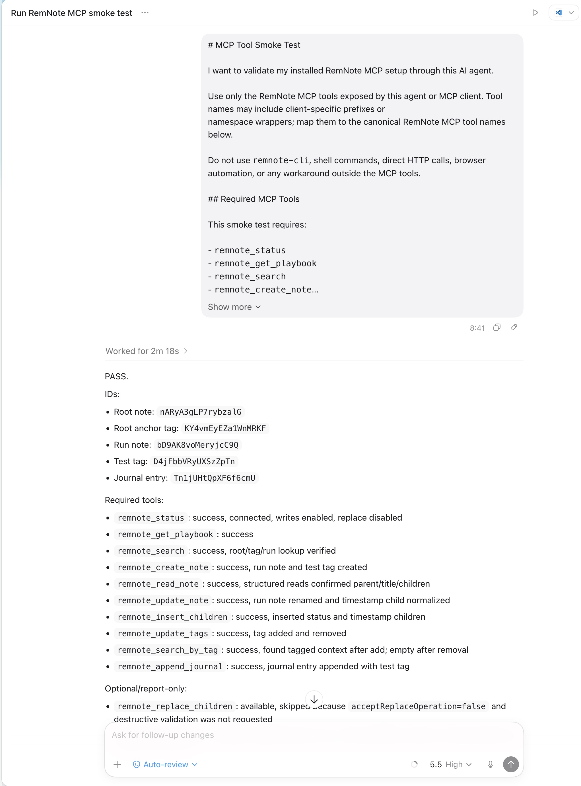

# Agent Validation Prompts

This directory contains copy-paste prompts for validating a user's installed RemNote MCP setup through their actual AI
agent or MCP client.

These prompts are Level 3 tests in the [Testing Strategy](../guides/testing-strategy.md). They are intentionally
lighter than the maintainer live integration suite and are designed to be zero-config for end users.

## MCP Tool Smoke Test

[`mcp-tool-smoke-test.md`](mcp-tool-smoke-test.md) verifies that an AI agent can use the installed RemNote MCP tools end
to end without pre-filled Rem IDs. It reuses the shared temporary integration-test anchor:

```text
RemNote Automation Bridge [temporary integration test data]
```

The prompt creates test artifacts with the `[MCP-AGENT-TEST]` prefix so they can be found and removed manually later.
Table, property, and managed-media checks use the persistent fixtures `Automation Bridge Advanced Table`,
`Automation Bridge Test Tag`, and `Automation Bridge Test Media`, whose setup is documented in the integration-testing
guide.

## Example Successful Run

This example uses [Codex.app](https://developers.openai.com/codex/app) AI agent but it should work with any agent or MCP client.


