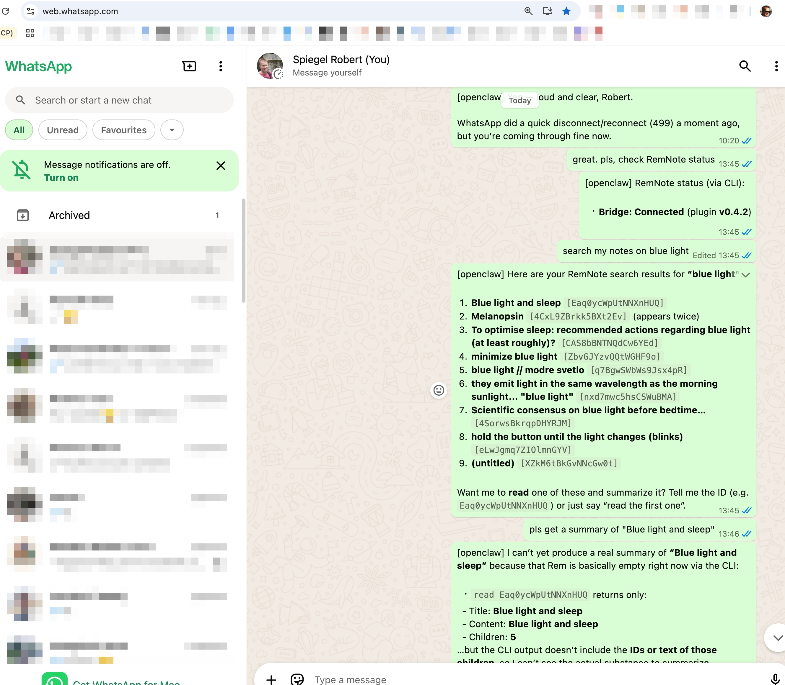
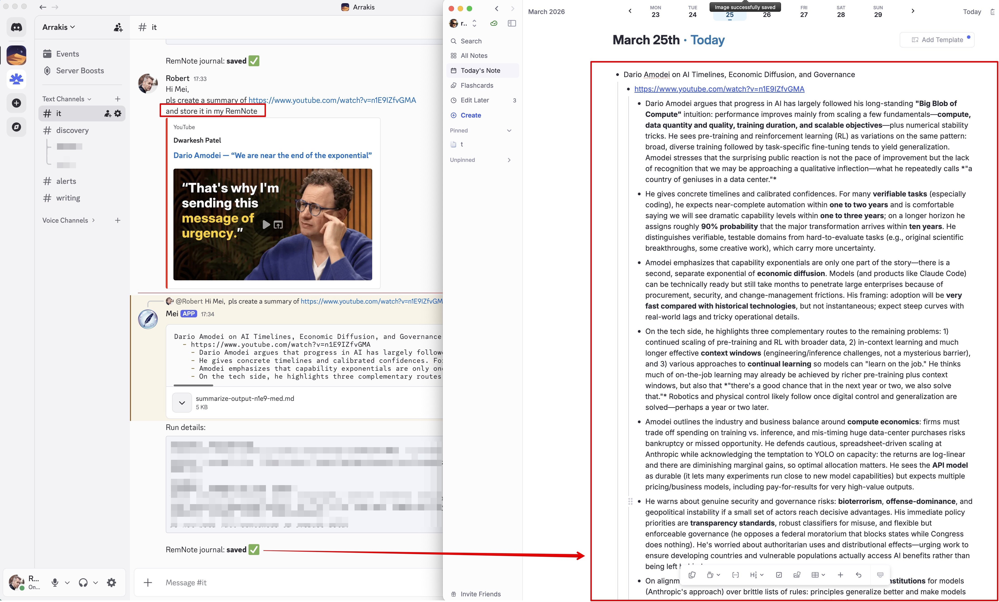

# Demo

Visual demonstrations of the RemNote MCP Server with different AI clients.

## ChatGPT

Web-based integration using ChatGPT Apps with a custom MCP server.

**Setup:** [ChatGPT Configuration Guide](guides/configuration-chatgpt.md)

### 1) MCP status preflight


ChatGPT calls `remnote_status` and reports connection, version alignment, and write/replace policy flags.

### 2) Notes-only synthesis


ChatGPT summarizes circadian-rhythm notes using MCP-retrieved RemNote content (notes-first synthesis).

### 3) Follow-up contradiction request


The user asks for a short comparison of notes vs. current internet knowledge, focused on differences/contradictions.

### 4) Notes vs internet diff output


ChatGPT returns a concise mismatch list, preserving note-grounded context while highlighting conflicts.

PS: I first treated the "take melatonin ~7 hours before sleep" claim as a model error/hallucination. In the next
answer, ChatGPT quoted my actual note and context ("Take melatonin 9 hours after wake and 7 before sleep, eg 5 PM" for
delayed phase sleep disorder), so this was still a distortion, but not fully made up.

## Claude Desktop / Cowork

Cloud-based integration through Anthropic's remote connector interface in Claude Desktop or Cowork.

**Setup:** [Claude Desktop / Cowork Configuration Guide](guides/configuration-claude-desktop-cowork.md) | [Remote Access Guide](guides/remote-access.md)

### Connection Status Check


Checking RemNote Bridge connection status, displaying plugin version (0.4.1) and available features (search, create,
read, update, journal append).

### Knowledge Base Search


Searching RemNote knowledge base for "blue light & sleep" with AI-generated summary. The RemNote Automation Bridge
plugin panel (right side) shows connection statistics and recent actions.

### Claude Desktop Search View


Claude Desktop using the same remote connector to search RemNote for "blue light & sleep", returning the matching
notes and their key context directly in chat.

## Accomplish

Task-based interface using [Accomplish (formerly Openwork)](https://github.com/accomplish-ai/accomplish) with [OpenAI's
GPT 5.2 model](https://openai.com/).

**Setup:** [Accomplish Configuration Guide](guides/configuration-accomplish.md)


The screenshot shows Accomplish querying RemNote about "diffusion of innovations" through the local MCP server. The
interface displays multiple MCP tool calls (`remnote_search` and `remnote_read_note`) with an AI-synthesized summary
of findings from the knowledge base.

## Claude Code CLI 

Local CLI-based integration showing search and connection logs.

**Setup:** [Claude Code CLI Configuration Guide](guides/configuration-claude-code-CLI.md)


The screenshot shows Claude Code CLI searching RemNote for "AI assisted coding" through the terminal, with RemNote Bridge
connection logs visible in the background.

## remnote-cli

Local command-line and coding-harness workflows using the `remnote-cli` executable bundled with this package.

### Use RemNote from Any Coding Harness

Any local coding harness that can run shell commands can use `remnote-cli`. The only server component is
`remnote-mcp-server`, which is shared with MCP clients.

Before you start:

1. Install `remnote-mcp-server` globally.
2. Start the MCP server: `remnote-mcp-server`.
3. Open RemNote and wait for the bridge to connect.
4. Verify: `remnote-cli status --text`.

Example prompt:

```text
read https://github.com/robert7/remnote-mcp-server/blob/main/skills/remnote/SKILL.md

check remnote status using remnote CLI
search remnote for "AI assisted coding"
```

#### Claude Code


Claude Code fetches `SKILL.md`, verifies MCP-server-backed bridge status, then searches RemNote.

#### GitHub Copilot CLI


The same prompt works in GitHub Copilot CLI and other local harnesses that can read URLs and run shell commands.

### Example of OpenClaw Chat Workflow with `remnote-cli`



This screenshot shows [OpenClaw](https://github.com/openclaw/openclaw) driving `remnote-cli` from a WhatsApp chat: it
checks bridge connectivity, searches for "blue light", returns matching note IDs, and then attempts a `read`-based
summary.

#### OpenClaw YouTube Summary Saved to RemNote Journal



This screenshot shows OpenClaw creating a YouTube video summary and storing it as a RemNote journal entry.

Command:

```bash
remnote-cli journal --content-file summarize-output-n1e9-med.md --no-timestamp
```

### CLI Status and Search


A typical local flow is:

1. Start `remnote-mcp-server`.
2. Run `remnote-cli status --text`.
3. Run `remnote-cli search "AI"`.

What this demonstrates:

- The CLI is a short-lived MCP client.
- JSON-first output is useful for automation and agent workflows.
- `status` and `status --text` are quick diagnostics when search/create calls fail.
