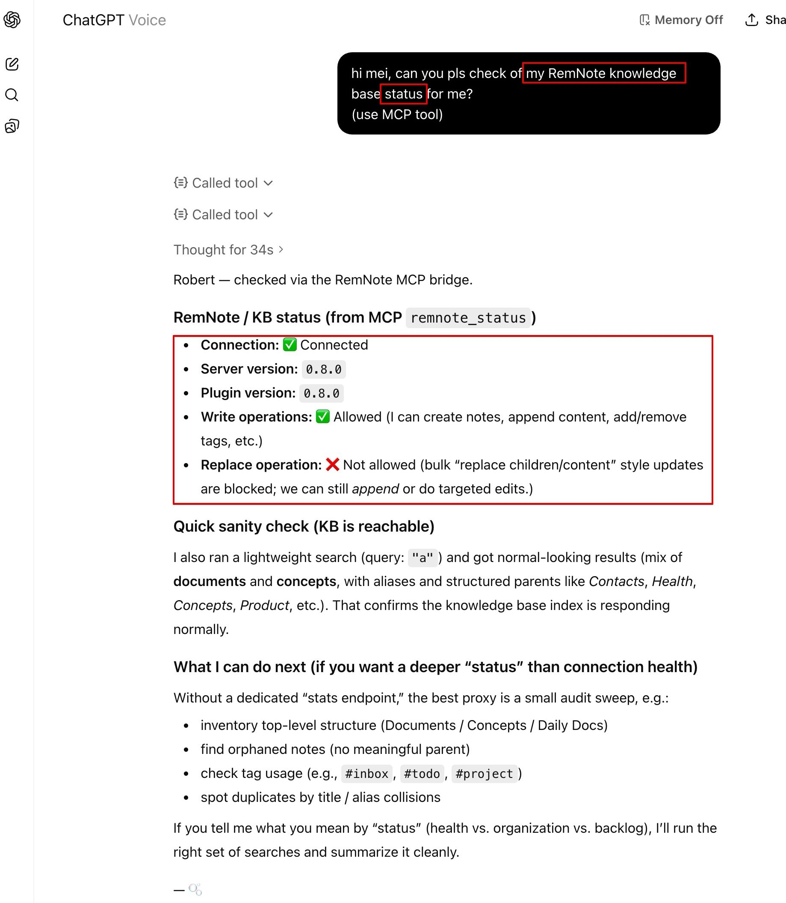
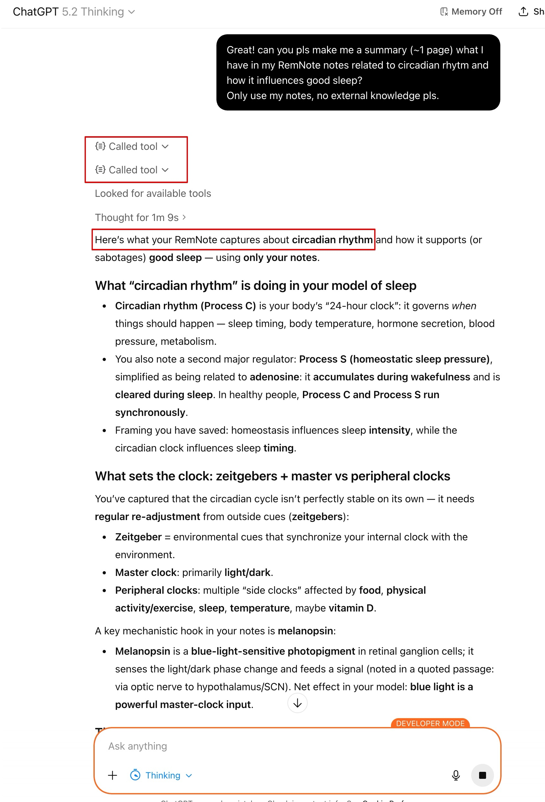
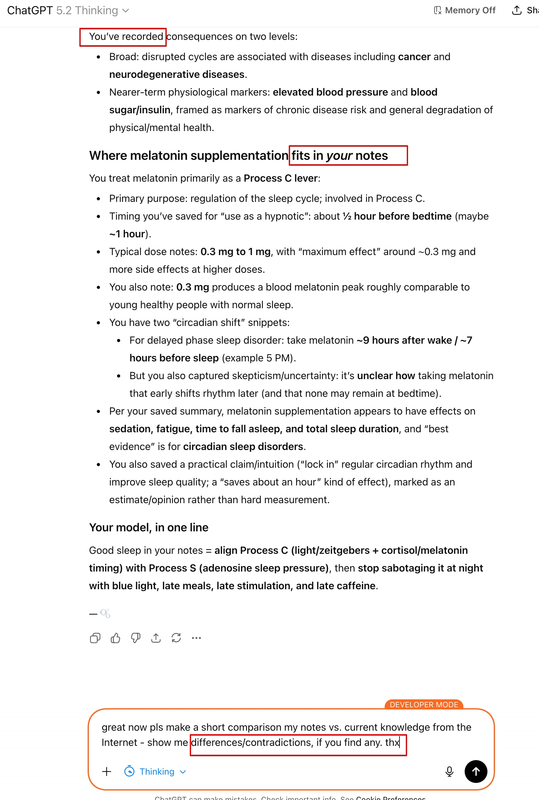
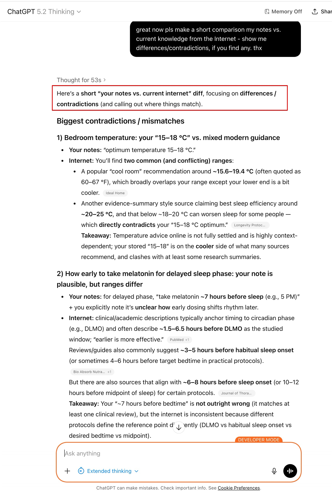

# ChatGPT Configuration

Set up ChatGPT Apps to connect to your RemNote MCP Server.

> Prerequisite: ChatGPT custom private MCP server setup currently requires Developer Mode to be enabled and an eligible
> paid ChatGPT subscription.  See:
> [OpenAI's Developer Mode guide](https://developers.openai.com/api/docs/guides/developer-mode/).

> Prerequisite: You also need a publicly reachable HTTPS MCP URL for your local server. Use
> [Remote Access Setup](remote-access.md) to configure ngrok/Cloudflare/Tailscale and security settings.

## Step 1: Open Apps settings

Open ChatGPT settings, go to **Apps**, and click **Create app**.

## Step 2: Create the MCP app

Enter your app details and MCP Server URL, confirm the custom server warning, then click **Create**.

## Step 3: Confirm app is enabled

Verify your `remnote` app appears in the enabled apps list.

## Step 4: Verify connection details and actions

Open the app details page to confirm URL, connection status, and exposed RemNote actions.

## Step 5: Run tool discovery

Ask ChatGPT to run discovery and verify it can list and call RemNote tools (including `remnote_status`).

## Step 6: Run a status preflight

Ask ChatGPT to check the MCP bridge status and verify connection plus capability flags.

## Step 7: Run a notes-only synthesis

Prompt ChatGPT for a focused summary grounded in your RemNote notes.

## Step 8: Ask for a targeted follow-up comparison

Use a follow-up prompt requesting differences/contradictions against current internet knowledge.

## Step 9: Confirm diff-style output

Verify ChatGPT returns a concise contradiction/mismatch list with clear takeaways.

