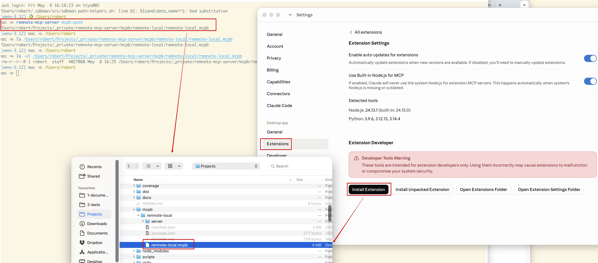
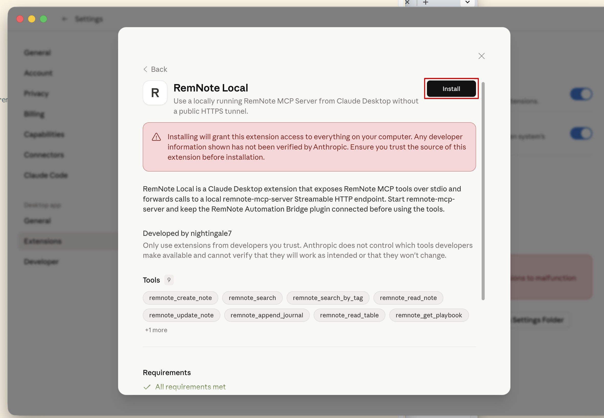
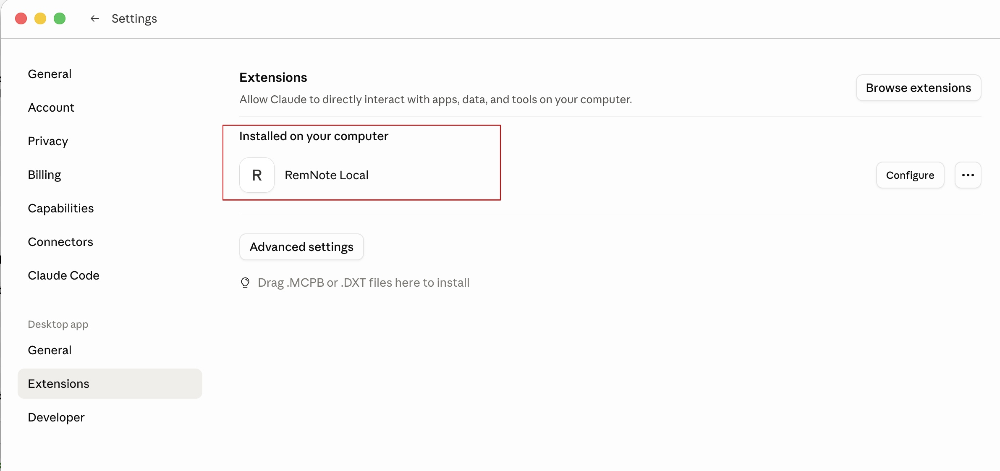
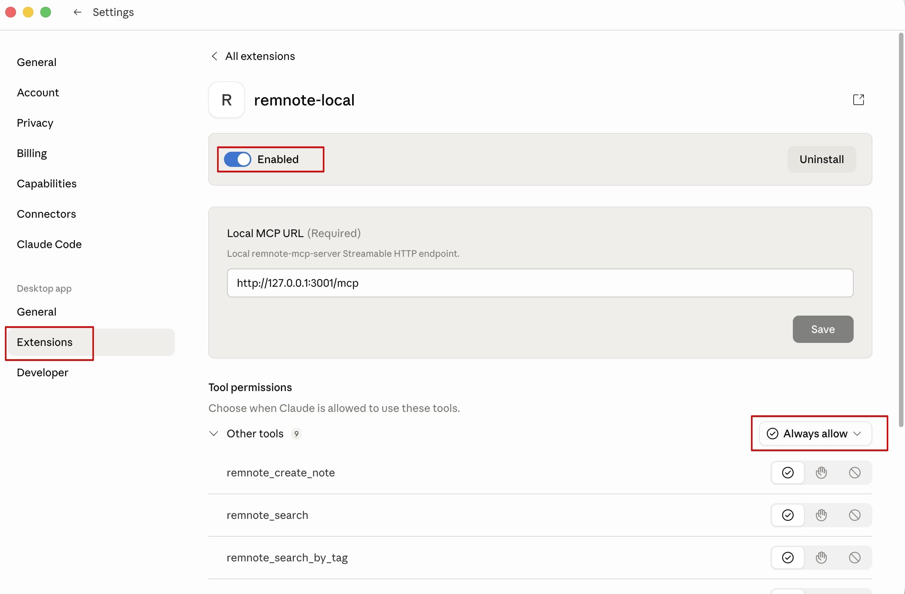
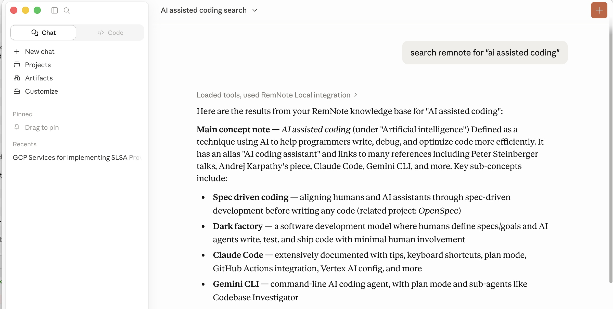

# Claude Desktop / Cowork Local MCPB Configuration

How to use RemNote MCP tools from Claude Desktop or Claude Cowork without exposing the local MCP server over public
HTTPS.

> **Local desktop option:** This setup is available from `remnote-mcp-server` v0.14.1+ and does not require remote
> access. It applies to Claude Desktop and Claude Cowork running in Claude Desktop when desktop extensions are enabled.
> For Claude web/mobile, cloud-hosted clients, or managed deployments where desktop extensions are disabled, use
> [Claude Desktop / Cowork Remote Connector Configuration](configuration-claude-desktop-cowork.md), which requires
> public HTTPS.

## Overview

Claude Desktop can install local MCP Bundle (`.mcpb`) extensions. Claude Cowork can use them in the Claude Desktop app
when desktop extensions are enabled. The RemNote local MCPB is a small stdio MCP proxy:

```text
Claude Desktop / Cowork <-> MCPB stdio proxy <-> http://127.0.0.1:3001/mcp <-> remnote-mcp-server <-> RemNote bridge
```

This avoids ngrok or other public HTTPS tunnels for local Claude Desktop and eligible Claude Cowork desktop sessions.

For local Claude Desktop or Claude Cowork in the desktop app, this is the preferred setup when `.mcpb` extensions are
available. Use the remote connector guide for Claude web/mobile, cloud-hosted clients, or managed deployments that
disable local desktop extensions.

For Claude Desktop's general local MCP extension workflow, see Anthropic's
[Getting Started with Local MCP Servers on Claude Desktop](https://support.claude.com/en/articles/10949351-getting-started-with-local-mcp-servers-on-claude-desktop).
For the bundle format and tooling, see the [MCPB repository](https://github.com/modelcontextprotocol/mcpb).

## Prerequisites

- RemNote MCP Server installed and running locally
- RemNote app running with the Automation Bridge plugin installed and connected
- Claude Desktop with desktop extensions enabled
  - For Claude Cowork on managed deployments, admins can disable `.mcpb` installation with `isDesktopExtensionEnabled`
    or require signed extensions.
- `remnote-mcp-server` installed from npm

## Locate the Extension

Install the package:

```bash
npm install -g remnote-mcp-server
```

Print the bundled extension path:

```bash
remnote-mcp-server mcpb-path
```

Expected output is an absolute path ending in:

```text
mcpb/remnote-local/remnote-local.mcpb
```

Use that path when Claude Desktop asks for the extension file:



The extension intentionally does not start `remnote-mcp-server`. Start the server separately in a terminal:

```bash
remnote-mcp-server
```

## Install in Claude Desktop

This follows Claude Desktop's custom extension flow:

1. Navigate to **Settings -> Extensions**.
2. Click **Advanced settings**.
3. In **Extension Developer**, click **Install Extension...**.
4. Select the `.mcpb` file printed by `remnote-mcp-server mcpb-path`.
5. Follow the install prompts.
6. Keep the default MCP URL unless you changed the server port:

```text
http://127.0.0.1:3001/mcp
```

Claude Desktop shows the extension summary before installation, including the RemNote MCP tools exposed by the bundle:



After installation, **RemNote Local** appears under installed extensions:



Open **Configure** to confirm the local MCP URL and choose tool permissions:



## Verify

Start a new Claude Desktop or Cowork session and run:

```text
Use remnote_status to check the connection
```

Expected: the response includes bridge connection information, server version, and plugin version.

You can also run a read-only search. Claude should show that it loaded tools and used the **RemNote Local** integration:



If the tool reports that it cannot connect to the local RemNote MCP Server, verify:

1. `remnote-mcp-server` is running.
2. RemNote is open.
3. The Automation Bridge plugin is connected.
4. The configured MCP URL ends with `/mcp`.

## Related Documentation

- [Configuration Guide](configuration.md) - Local Streamable HTTP setup
- [Claude Desktop / Cowork Remote Connector Configuration](configuration-claude-desktop-cowork.md) - Remote HTTPS
  connector setup
- [Remote Access Setup](remote-access.md) - Required for cloud clients and managed deployments without local MCPB
