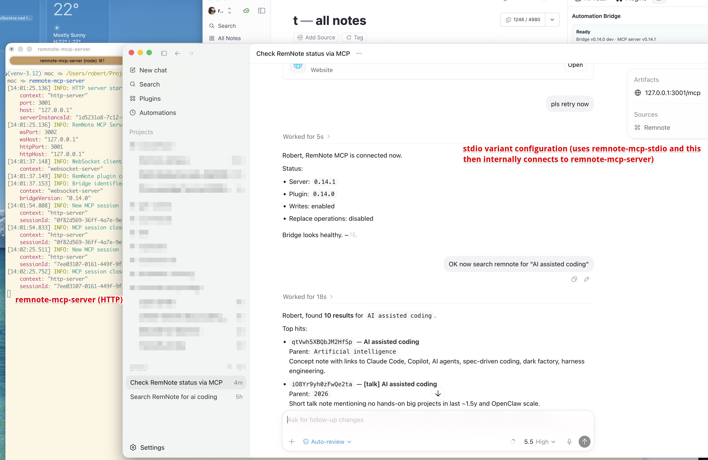
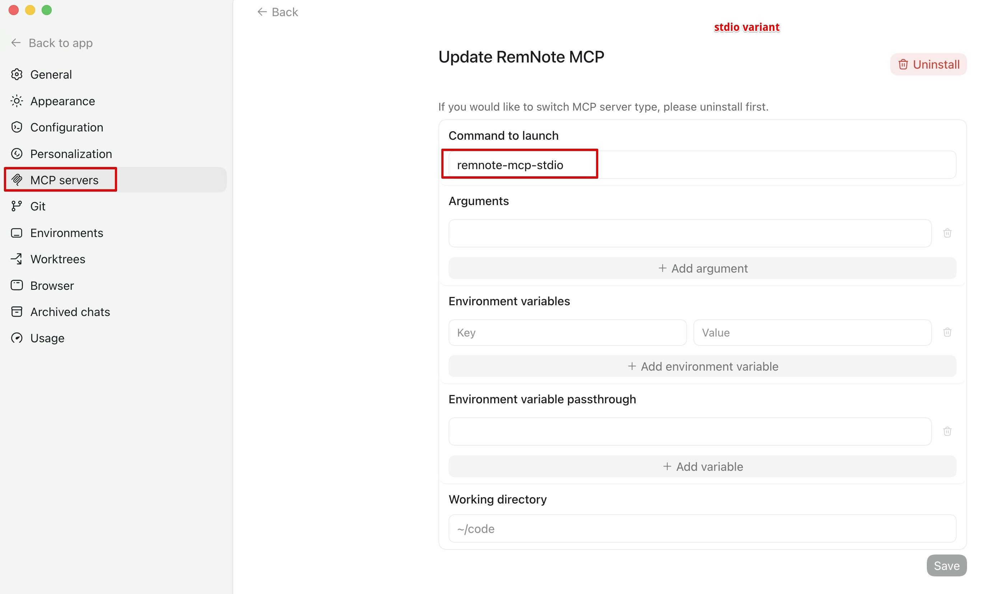
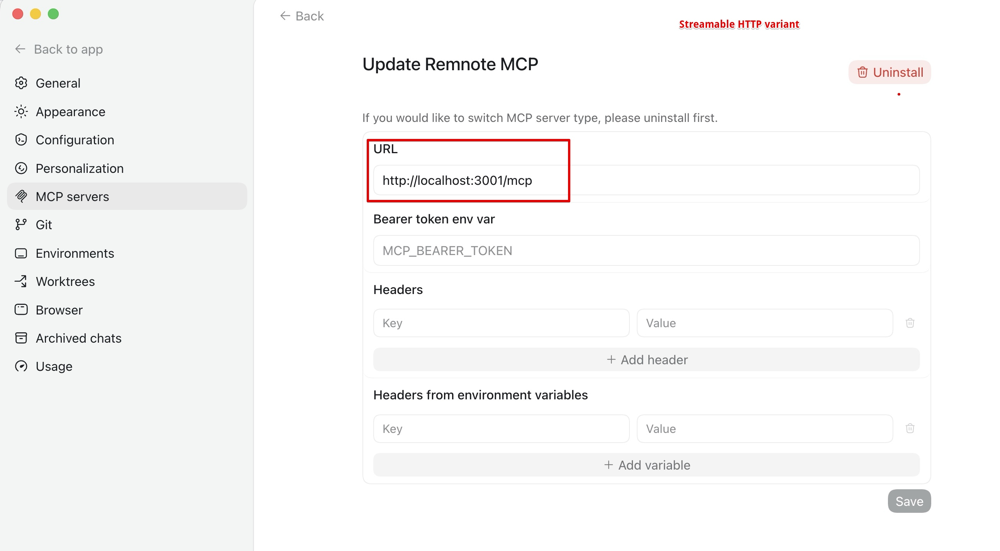
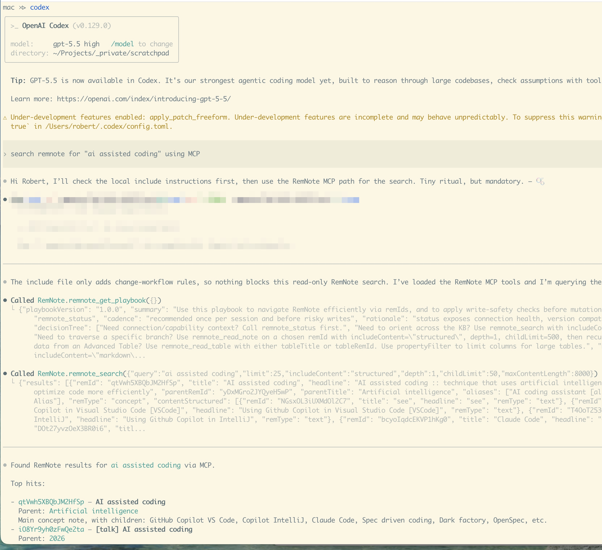
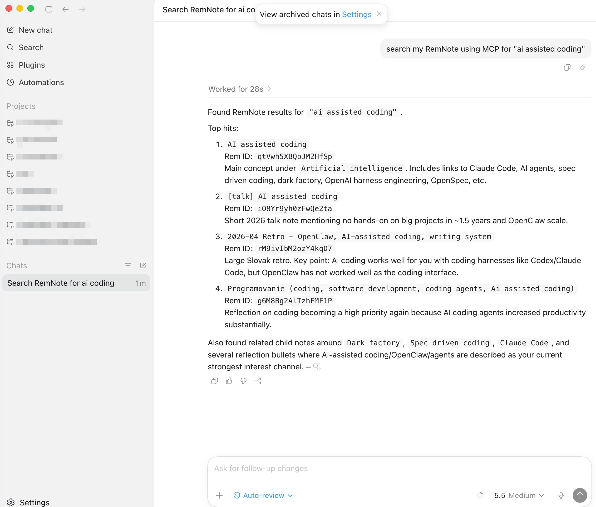
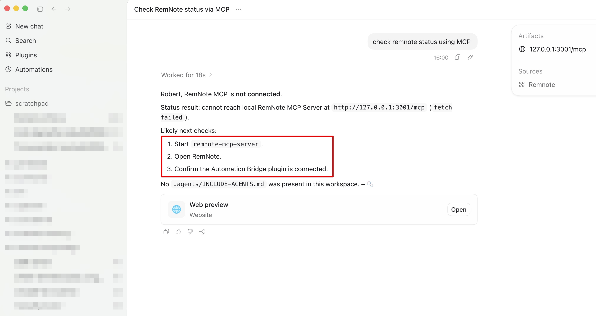
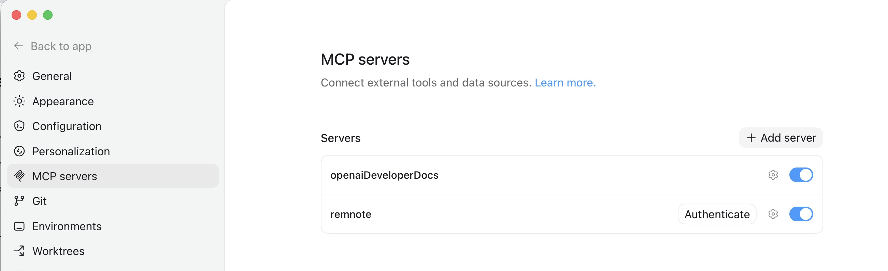

# Codex Configuration

How to configure Codex TUI (`codex`) and Codex.app to use RemNote.

## Overview

Codex can use RemNote in three ways:

1. Streamable HTTP MCP connection to `remnote-mcp-server` (recommended).
2. Stdio MCP proxy through `remnote-mcp-stdio`.
3. `remnote-cli` plus the bundled RemNote skill, with no Codex MCP configuration.

In all three cases, `remnote-mcp-server` must be running and the RemNote Automation Bridge plugin must be connected.
For the CLI skill path, `remnote-cli` must also be available on the `PATH` visible to Codex.

## Prerequisites

Install the package:

```bash
npm install -g remnote-mcp-server
```

Start the server:

```bash
remnote-mcp-server
```

Then open RemNote and wait for the Automation Bridge plugin to connect to `ws://127.0.0.1:3002`.

## Option 1: Streamable HTTP MCP

Use this when Codex can connect to a Streamable HTTP MCP server. This is the simplest native MCP configuration.

### Codex.app

Open **Settings -> MCP servers**, add a server named `RemNote`, and set the URL:

```text
http://localhost:3001/mcp
```



### Codex TUI

Add the server from a terminal:

```bash
codex mcp add RemNote --url http://localhost:3001/mcp
```

Verify:

```bash
codex mcp list
codex mcp get RemNote
```

### Manual `config.toml`

You can also edit `~/.codex/config.toml` directly:

```toml
[mcp_servers.RemNote]
url = "http://localhost:3001/mcp"
```

Restart Codex after editing the file.

## Option 2: Stdio MCP Proxy

Use this when a Codex environment can launch local stdio MCP commands but Streamable HTTP configuration is inconvenient.

`remnote-mcp-stdio` is a stdio-to-HTTP proxy. It is not the main RemNote-facing server. It forwards Codex tool calls to
the already-running `remnote-mcp-server` endpoint.

Prerequisite: before Codex can use this stdio proxy, `remnote-mcp-server` must already be running and the RemNote
Automation Bridge must be connected to it.

```text
Codex -> remnote-mcp-stdio -> remnote-mcp-server :3001 -> RemNote Automation Bridge :3002 -> RemNote
```

For the generic stdio MCP client model, see [Stdio MCP Clients](configuration.md#stdio-mcp-clients).

### Codex.app

Open **Settings -> MCP servers**, add a server named `RemNote`, and set the launch command:

```text
remnote-mcp-stdio
```



### Codex TUI

Add the stdio proxy:

```bash
codex mcp add RemNote -- remnote-mcp-stdio
```

Verify:

```bash
codex mcp list
codex mcp get RemNote
```

### Manual `config.toml`

Default local endpoint:

```toml
[mcp_servers.RemNote]
command = "remnote-mcp-stdio"
```

Custom endpoint:

```toml
[mcp_servers.RemNote]
command = "remnote-mcp-stdio"
env = { REMNOTE_MCP_URL = "http://127.0.0.1:3001/mcp" }
```

If `REMNOTE_MCP_URL` is omitted, `remnote-mcp-stdio` uses `http://127.0.0.1:3001/mcp`.

## Option 3: `remnote-cli` Skill

Use this when you do not want to configure Codex MCP at all. Codex can read the RemNote skill and use `remnote-cli`
through shell commands.

Example prompt:

```text
read https://github.com/robert7/remnote-mcp-server/blob/main/skills/remnote/SKILL.md

check remnote status using remnote CLI
search remnote for "AI assisted coding"
```

This path still depends on the same running server and connected bridge:

```text
Codex -> remnote-cli -> remnote-mcp-server :3001 -> RemNote Automation Bridge :3002 -> RemNote
```

## Verification

For native MCP setup, ask Codex:

```text
check remnote status using MCP
```

Healthy output should show the MCP server version, bridge plugin version, and write-policy flags.



Then try a read-only search:

```text
search my RemNote using MCP for "AI assisted coding"
```

In Codex TUI, the transcript should show RemNote MCP tool calls such as `remnote_get_playbook` and
`remnote_search`, followed by the summarized search results.



In Codex.app, the same native MCP setup appears as RemNote in the Sources panel.



For the CLI skill path, verify from the shell:

```bash
remnote-cli status --text
```

## Troubleshooting

If Codex shows the RemNote MCP source but the call fails, check the runtime chain:

1. `remnote-mcp-server` is running.
2. RemNote is open.
3. The Automation Bridge plugin is connected.
4. The configured URL includes `/mcp`.
5. For stdio, `remnote-mcp-stdio` is on Codex's `PATH`.
6. For the CLI skill path, `remnote-cli` is on Codex's `PATH`.



You can inspect configured Codex MCP servers from the TUI environment:

```bash
codex mcp list
codex mcp get RemNote
```

Codex.app lists configured servers under **Settings -> MCP servers**:


