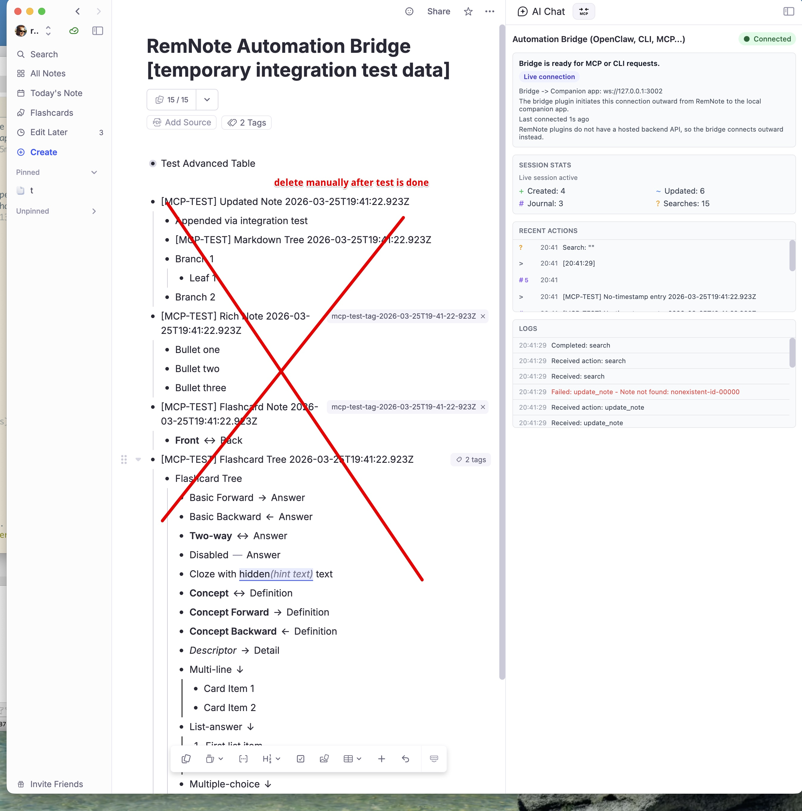
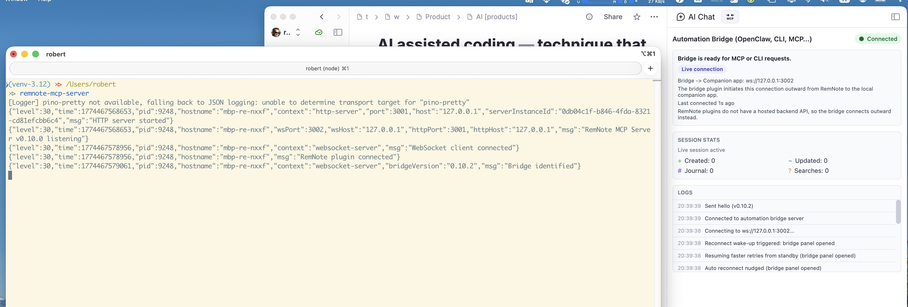

# Integration Testing

This is the canonical workflow for updating and running shared integration coverage for `remnote-mcp-server` and
`remnote-cli`.

Use it when a feature changes the shared bridge-consumer surface and should be validated end to end against a live
RemNote instance.

The direct MCP suite, MCPB stdio proxy suite, and bundled CLI suite all live in this repository.

## Safety And Cleanup

Integration tests create new RemNote data, but they do **not** delete, overwrite, or replace existing user data.

Artifacts are easy to find because they are grouped predictably:

- MCP server artifacts use the `[MCP-TEST]` prefix
- CLI artifacts use the `[CLI-TEST]` prefix
- note/tree artifacts live under `RemNote Automation Bridge [temporary integration test data]`
- journal artifacts appear in Today's Note with the same prefixes

RemNote's bridge surface does not expose delete operations, so cleanup stays manual by design.




## Prerequisites

1. RemNote running with the RemNote Automation Bridge plugin installed
2. MCP server available if using `run-integration-test.sh` directly. For the agent wrapper, port `3001` must be free so
   it can start its own repo-local server.
3. Bridge connected to the WebSocket server

If the bridge is connected correctly, the server logs show the plugin connection and RemNote shows the Automation
Bridge as connected.



## Running The Suites

### Full Suite

```bash
# Manual — prompts once before creating content, then runs direct MCP, MCPB stdio proxy, and bundled CLI suites
./run-integration-test.sh

# Non-interactive — skips confirmation
./run-integration-test.sh --yes

# Agent-assisted — requires port 3001 to be free, starts its own server, waits for bridge connection, then runs all suites
./run-agent-integration-test.sh
./run-agent-integration-test.sh --yes
```

`npm run test:integration` delegates to `./run-integration-test.sh`, so it also runs all suites by default.

The agent-assisted wrapper does not control existing MCP server processes. Before an AI agent invokes any live
integration command, it must explicitly probe the configured HTTP MCP port (`127.0.0.1:3001` by default). If anything is
listening there, including a macOS launchd-managed `remnote-mcp-server`, the agent must refuse to run tests and report
that the existing server needs to be stopped manually. The wrapper repeats this port check and exits with a clear error
if the port is occupied. During cleanup, the wrapper stops only the repo-local server process it started for the current
test run.

AI agents must run the agent-assisted wrapper outside the Codex sandbox. The TypeScript runners use `tsx`, which creates
local IPC pipes under macOS temp directories such as `/var/folders/...`; inside the sandbox this can fail before tests
start with `listen EPERM`.

### Targeted Reruns

```bash
# Direct MCP path only
./run-integration-test.sh --suite mcp
./run-agent-integration-test.sh --suite mcp --yes

# Claude Desktop MCPB stdio proxy path only
./run-integration-test.sh --suite mcpb
./run-agent-integration-test.sh --suite mcpb --yes

# Bundled remnote-cli path only
./run-integration-test.sh --suite cli
./run-agent-integration-test.sh --suite cli --yes

# Fast connection check only (no test data creation)
./run-status-check.sh
```

The MCPB suite launches `mcpb/remnote-local/server/index.js` over stdio and points it at the same live MCP server
endpoint via `REMNOTE_MCP_URL`. It runs the RemNote tool workflows through the Claude Desktop-facing proxy path. The
direct HTTP OAuth workflow remains direct-MCP-only because OAuth metadata is an HTTP server surface, not stdio proxy
behavior.

The CLI suite uses the same MCP server endpoint as MCP clients. It does not start or require a separate CLI server.
The agent-assisted wrapper is the only approved live-test entrypoint for AI agents; `run-integration-test.sh` and
`npm run test:integration*` are manual/human entrypoints. The agent wrapper times out with a clear message when the
RemNote bridge never connects.
Agent-assisted flow still has one manual gate: the agent should ask the human collaborator to start the bridge first,
and must ask for a bridge restart before reruns if bridge code changed since the current RemNote bridge session
started.

Successful runs print a workflow summary and remind you how to clean up the created artifacts.


## Configuration

| Variable | Default | Purpose |
|---|---|---|
| `REMNOTE_MCP_URL` | `http://127.0.0.1:3001` | MCP server base URL |
| `MCP_TEST_DELAY` | `2000` | Delay (ms) after creating notes before searching |

The CLI suite uses the same variables.

## Where To Add New Coverage

If a pull request changes shared external behavior, update both integration surfaces where the feature can be exercised.

- Combined shell entrypoint: [`run-integration-test.sh`](../../run-integration-test.sh)
- Agent-safe shell entrypoint: [`run-agent-integration-test.sh`](../../run-agent-integration-test.sh)
- MCP and MCPB runner: [`test/integration/run-integration.ts`](../../test/integration/run-integration.ts)
- MCP server workflows: [`test/integration/workflows/`](../../test/integration/workflows/)
- CLI runner: [`test/integration/cli/run-integration.ts`](../../test/integration/cli/run-integration.ts)
- CLI workflows: [`test/integration/cli/workflows/`](../../test/integration/cli/workflows/)

The usual rule is simple: if users can reach the new behavior through both MCP tools and `remnote-cli`, both
integration suites should gain coverage.

## What The Suites Test

The direct MCP and MCPB stdio proxy suites follow the same RemNote tool workflow shape:

1. **Status Check** — Verifies the live consumer path is connected to the bridge. If this fails, all subsequent workflows are
   skipped.
2. **Create & Search** — Creates notes and exact-ID tag Rems, waits for RemNote indexing, then
   validates search and tag-search behavior across the supported content modes.
3. **Read & Update** — Reads the created notes, updates title/content/tags by exact Rem ID, and re-reads to verify persistence.
4. **Journal** — Appends entries to today's daily document with and without timestamps.
5. **Error Cases** — Sends invalid inputs (nonexistent IDs, missing required fields) and verifies the server handles
   them gracefully.
6. **Read Table** — Reads a pre-configured Advanced Table by name and Rem ID, then validates pagination, filtering,
   and not-found behavior.

The direct MCP suite also verifies the OAuth HTTP metadata and token endpoints.

## Cleanup After A Run

Test content uses `[MCP-TEST]` or `[CLI-TEST]` prefixes plus unique run IDs (ISO timestamps), and note/tree artifacts
are grouped under the shared root-level anchor note `RemNote Automation Bridge [temporary integration test data]`.

To clean up:

- search RemNote for `[MCP-TEST]` and delete the matching note/tree artifacts
- search RemNote for `[CLI-TEST]` and delete the matching CLI-created artifacts
- open Today's Note and remove the matching journal entries

RemNote's bridge plugin does not support deleting notes, so test artifacts persist and must be cleaned up manually.
The shared anchor note is reused across runs. If more than one exact anchor-title match exists, the integration setup
fails early and prints the duplicate `remId`s so you can clean them up first.

## Design Rationale

The integration tests are deliberately separate from the unit test suite. They require external infrastructure (running
server + connected plugin), create real content, and take seconds rather than milliseconds. They run via `tsx` with
custom lightweight assertions rather than Vitest to stay independent from the mocked unit-test environment.

Tag coverage:

- The shared live suites assert readable `tags` on plain `remnote_search` and `remnote_read_note` for notes created with
  exact tag Rem IDs.
- They also verify exact-ID tag add/remove flows through both `remnote_search_by_tag` and direct `remnote_read_note`
  readback.

## Read Table Configuration

The `read_table` workflow requires a pre-existing Advanced Table in RemNote. This keeps the coverage read-only while
still validating the shared bridge-consumer contract.

### Setup

1. Create an Advanced Table in RemNote with at least one row and one column.
2. Record the table's exact name and `remId`.
3. Create or edit the config file at:

   **Windows:** `C:\Users\<your-username>\.remnote-mcp-bridge\remnote-mcp-bridge.json`

   **macOS/Linux:** `~/.remnote-mcp-bridge/remnote-mcp-bridge.json`

4. Add the integration test configuration:

```json
{
  "integrationTest": {
    "tableName": "Your Table Name",
    "tableRemId": "abc123def"
  }
}
```

### Running

Run the integration suite as usual:

```bash
./run-integration-test.sh
```

The `read_table` workflow is skipped when either field is missing or the config is invalid.
